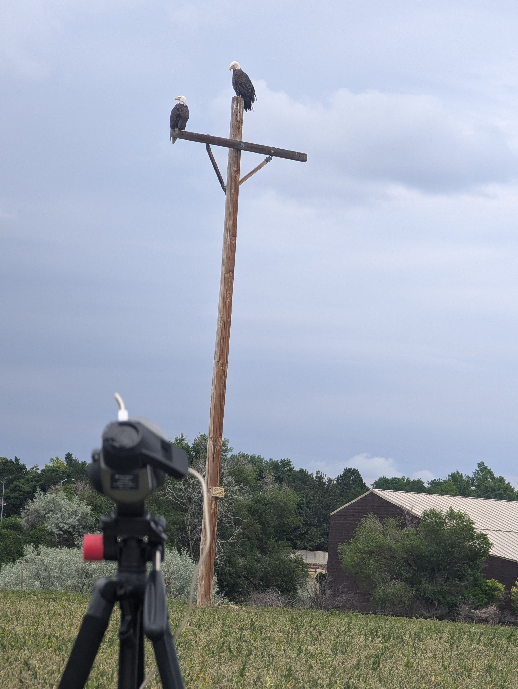
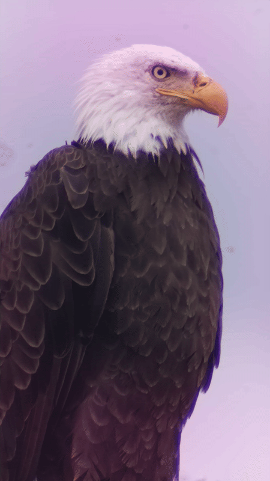

### The Setup

The Raspberry Pi and camera are attached to a spotting scope with a 3D printed mount.

### Results

A bald eagle from ~60m away (taken from the same location as the setup photo above)

### A few other MP4s:

[Sandhill Cranes doing their mating dance](sandhill_cranes_120_meters.mp4)

[Bald Eagle from ~150m away](bald_eagle_150_meters.webm)
